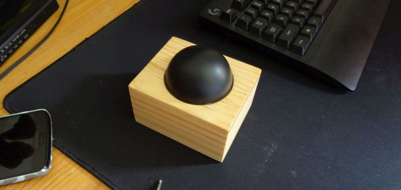

# IR-Remote-Mute-Button
A simple one button remote control to mute devices. Built around an 8MHz 3.3V Arduino Pro Mini.  
  

  
More details about this project are available on my blog https://garrysblog.com/2020/12/05/ir-remote-control-mute-button/
